# Analysis of Car Listings
This is a group project completed by:
- [Dylan Fernandes](https://github.com/DylJFern)
- [Jamie Lepard](https://github.com/j-lepard)
- [Kieran Anson-Cartwright](https://github.com/kansonc)

## <br>Introduction
### Purpose
The purpose of this project is to combine and practice implementing what has been learned thus far by leveraging data to explore a problem and present our findings. 

### <br>Objective
The objective is to define a specific problem and thoroughly investigate it using various data analysis techniques, such as data retrieval, exploratory data analysis, and statistical modelling in Python, and visualizing our findings in Tableau. This analysis will be presented through a visualization dashboard, aiming to showcase key insights and propose potential solutions. Additionally, a user-friendly tool will be developed, enabling non-technical users to easily interact with and utilize the dashboard.

## <br>Process
### Project Planning
- The selected dataset is based on the '[100,000 UK Used Car Dataset](https://www.kaggle.com/datasets/adityadesai13/used-car-dataset-ford-and-mercedes/)'.
- We will be focusing on the cleaned csv files of the different brands (this excludes brand specific ones like cclass.csv and focus.csv).

### <br>Project Setup
- Create a collaborative project on GitHub.

### <br>Project Workflow
#### Step 1
- Familiarize ourselves with the dataset, this includes:
  -  Learning the relevant terms.
  -  What kind of information the dataset contains.
  -  The kind of questions can we answer with the dataset.
  -  The insights we can gain and business problem we can define.
#### Step 2
- Initial exploration into the types of visualization we may want to include to answer our business problem.
- Initial examination of the data (e.g. the number of rows contain in each file).
#### Step 3
- Creating DataFrames (individual and combined) from the individual csv files of interest.
  - Implement data cleaning strategies.
  - Verifying data integrity.
- Feature engineering (e.g. add the associated brand and country identifiers).
#### Step 4
- EDA (python) process: 
  - Additional cleaning procedures.
  - Data distribution (histograms) and normalization using logarithmic transformations.
  - Different outlier identification methods (boxplots) to showcase price's dependency on multiple factors.
  - Correlation analysis (heatmap) to better understand the features.
- Multivariable regression analysis to quantify the relationship between multiple predictors (features) and price.
    - One-hot encoding.
    - Linear regression model(s) and proof of concept for numeric and categorical data.
    - Export data and model(s) to Tableau.
#### Step 5
##### Presentation of Tableau dashboards and tools:
- Tableau file: Midterm.twbx
  - Explain our EDA process.
  - Provide a tool for our clients, the used car sellers, to understand the distribution of price by categories.
  - Describe our outlier procedure and insights.
  - Show the different transformations for quantitative attributes.
  - Show the scatter plots to depict the relationship between the Y and X values.
  - Show a correlation matrix of the model values.
  - Show the difference between Y and Log(Y).
  - Deliver a tool that allows 'a used car seller' to access a car based on the predictor variables in the model.
- Tableau file: Regression_Chart.twbx
  - To explain the model's coeficients and ability in non technical detail.
  
### <br>Project Development
- Utilize communication tools (e.g. Google documents, Discord) to discuss and share ideas.

## <br> Results
The dataset contains characteristics related to the vehicle:
- model: The specific designation given to a particular type or version of a vehicle made by a manufacturer.
- year: The year in which the vehicile was manufactured or registered. 
- price: The monetary value associated with buying or selling the vehicle.
- transmission: Determines how power is transmitted from the engine to the wheels using gears.
- mileage: The total distance (in miles) the vehicle has travelled (indicates how much it has been used).
- fuelType: The type of fuel the vehicle uses to generate power and operate.
- tax: The tax amount associated with owning or using the vehicle (can depend on emissions, vehicle type, or government regulations).
- mpg: The miles per gallon; a measure of a vehicle's fuel efficiency, representing the number of miles it can travel using one gallon of fuel.
- engineSize: The size or capacity of the vehicle's engine (in litres), it provides an indication of the engine's power and performance capabilities.

### <br>Data Cleaning and Exploratory Data Analysis
#### Data Cleaning
- The string data in the csv files would contain whitespace which made it difficult to reference specific columns and display particular rows. For example, the following code would return an empty DataFrame, even though we knew there existed multiple entries of a Ford Fiesta.
```python
data[(data['brand'] == 'Ford') & (data['model'] == 'Fiesta')]
```

- The numeric data 'tax' contained a mix of US dollars and pounds, in some csv's the column would be displayed as either tax or tax(£). This was fixed by checking if the column 'tax(£)' existed in the csv DataFrame and then accordingly replacing it with 'tax' and with a multipler (based on the conversion rate at the time) for each the corresponding row.
```python
# convert pounds to US dollars
if 'tax(£)' in csv_file_df.columns:
  # assume conversion rate of 1.22
  csv_file_df.insert(8, 'tax', csv_file_df['tax(£)'] * 1.22)
  csv_file_df.drop('tax(£)', axis = 1, inplace = True)
```

- The corresponding country and brand were added to the DataFrame as it was being created (using a for-loop) from the entries of each csv file.
  - The csv file name was extracted and inserted as a column with appropriate capitalization applied.
  - The country was mapped (using a pre-defined dictionary) to the file name (or vehicle 'brand') and inserted as a column with appropriate capitalization applied.
```python
# extract the brand name from csv file name
brand_name = os.path.splitext(os.path.basename(csv_file))[0]
if brand_name.lower() == 'mercedes-benz':
  brand_name = 'Mercedes-Benz'
elif brand_name.lower() == 'bmw':
  brand_name = 'BMW'
else:
  brand_name = brand_name.capitalize()
                  
# add a column for the "country" based on brand_name as the first column
csv_file_df.insert(0, 'country', brand_country_mapping.get(brand_name, None))
        
# add a column for the "brand" as the second column with all other columns preceding it
csv_file_df.insert(1, 'brand', brand_name)
```

#### <br> Exploratory Data Analysis
- From initial inspection of the rows, we notice that the data contained.
  - 1 count of 'year' equal to 2060 (assumed to be a typo based on comparison with other 2006 Ford Fiesta's, value changed to 2006).
  - 2 counts of 'year' equal to 1970 (removed due to gap between 'year' value and next sequential 'year' equal to 1996).

- Initial insights obtained in information gathering stage helped us formulate the hypothesis that 'price' is dependent on all other predictors.
##### Histograms
- Visualize the distribution of each numerical variable in our data.

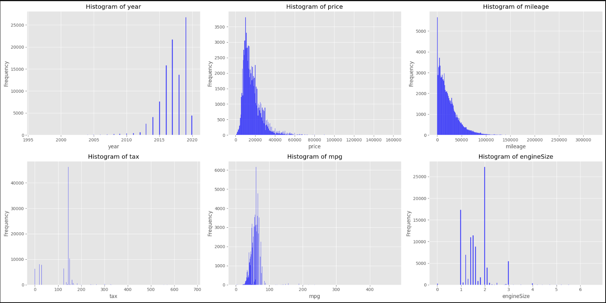

- From the histograms we noticed that all the numeric data had a skewed distribution. To stabilize variance and make the data more normally distributed we applied the logarithmic function (to all numeric data types except 'year').
```python
for col in columns_to_transform:
    # get the index location of a particular column in the original DataFrame
    original_col_index = used_cars_log_df.columns.get_loc(col)
    # insert the transformed column following the original column
    used_cars_log_df.insert(original_col_index + 1, col + '_log', np.log(used_cars_log_df[col] + 1)) # add 1 to handle zero values (log10(0) = null and log10(1) = 0)
```

- By applying the logarithmic transformation, we were able to convert the data to a more normal distribution. We can then use this to examine potential outliers that may exist by plotting variations of the transformed price.  
  - Plotted the transformed price evaluated by year.  
  - Plotted the transformed price dependence on the transformed predictor mileage evaluated by year.

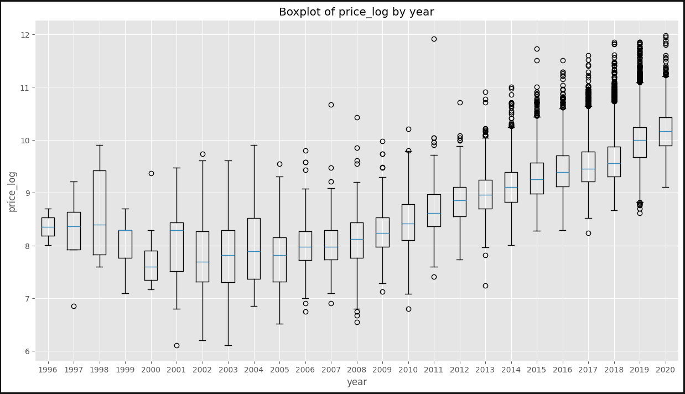

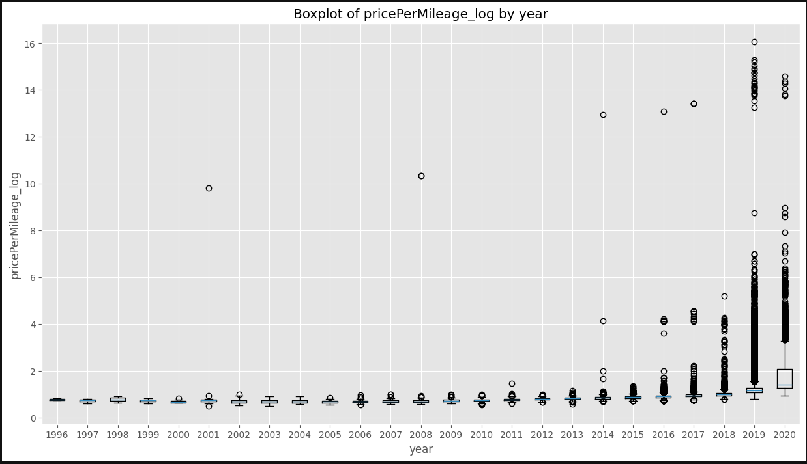 

- Through this process we explored different ways of identifying potential outliers that exist within the data. However, we did not "handle" them since the process did not provide any conclusive evidence. In other words, it was observed that the complexities of 'price' could not be captured by any single variable alone (e.g. price per mileage, although 'mileage' is an important factor, it certainly is not the only determinant of a vehicle's price), but rather is influenced by a multitude of possible predictors including 'year', 'engineSize', 'brand', etc. and eliminating the outliers based on 'price' alone would not make sense. In this case, we turned to correlation and regression to see if it could help us better understand and quantify the relationships between features (predictors) and price.

### <br>Correlation Analysis
- The goal is to construct a heatmap to show the correlation(s) in our data.
- The data contains categorical variables and numerical values.
- In general, converting categorical variables to numerical values can be useful for analysis.
  - This assumes they are ordinal or at least represent some kind of order.
- There are three possible methods we can consider:
  - Label encoding
  - One-hot encoding
  - Direct key-mapping
- Encoding is a process of converting categorical data (non-numeric) into a numeric format that can be used by machine learning models. There are several ways to perform encoding, two common methods being "one-hot encoding" and "label encoding".

#### <br>Label encoding
> Used when the categorical feature is assumed to be ordinal, implying some form of order or ranking, although it might not be accurate in practice. Assigns a unique numerical label to each category. It is commonly utilized when preserving space is a priority or when the data has a clear ordinal relationship. But may introduce a misleading ordinal relationship, which can lead to misinterpretations by some machine learning algorithms.
>
> The categorical variable 'transmission' in the dataset is represented as either "manual". "automatic", "semi-auto", or "other". In label encoding, this categorical variable would aggregate the different categories into a single column 'transmission' with numeric labels.
>
> For example, for the categorical variable 'transmission' it would create a label encoding that is represented as follows:
> - 'transmission_encoded'

#### One-hot encoding (also known as dummy encoding)
> Used when the categorical feature is nominal, meaning there's no inherent order or ranking between categories. It creates separate binary columns for each category, indicating the presence (1) or absence (0) of the category. It accurately  represents the categorical nature of the data without introducing false ordinal relationships. However, it typically increases dimensionality, which might be a concern with limited space or when dealing with a large number of categories.
>
> For example, for the categorical variable 'transmission', it would create four separate binary columns (dummy variables):
> - 'transmission_manual': [1, 0, 0, 0]
> - 'transmission_automatic': [0, 1, 0, 0]
> - 'transmission_semi-auto': [0, 0, 1, 0]
> - 'transmission_other': [0, 0, 0, 1]

#### Direct key-mapping
> Assigns a unique numerical value to each category directly, creating separate numerical labels. It is somewhat similar to one-hot encoding in terms of generate separate numerical labels for each category, but without the binary representation. Essentially creating a set of numerical representations for the categories without implying any specific relationship. However, it can also be misleading if the numerical values are misinterpreted as having a meaningful relationship or order. 
>
> For example, for the categorical variable 'transmission', a possible key-mapping of numeric labels could be represented as follows: 
>
>
> 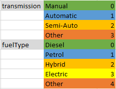

<br>

- We want to represent 11 numerical variables and 3 categorical variables on a heatmap. The categorical variables are:
  - 'brand' which has 9 categories ("Audi, "BMW", etc).
  - 'transmission' which has 4 categories ("Manual", "Automatic", etc).
  - 'fuelType which has 5 categories ("Diesel", "Petrol", etc).
- To appropriately represent the nominal categorical variables with no inherent order, our ideal choice would be to use one-hot encoding, but it would not be feasible to represent a total of 29 columns (and rows) on a heatmap in Python due to limited space for visualization.
- The choice of label encoding was made to maintain a manageable number of columns while still attempting to represent the categorical nature of the data.  


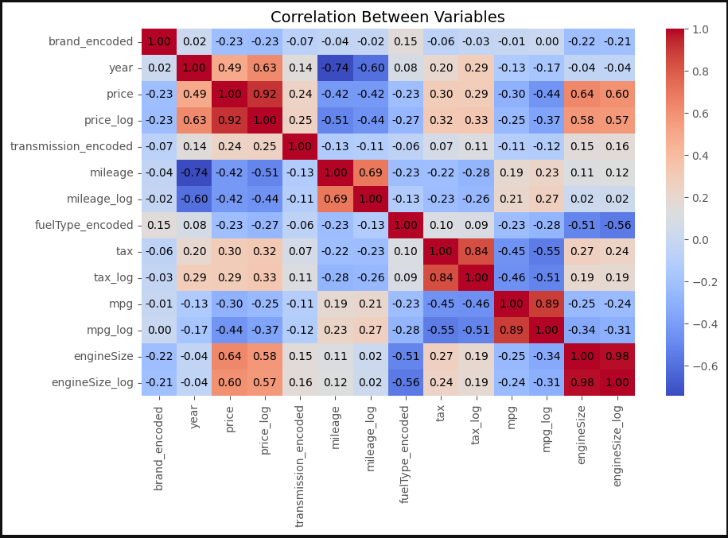

Note: it may be difficult to accurately describe the results due to the encodings and the assumptions made. We will also be primarily examing the "_encoded" and "_log" (normalized) values.

- From the encoded heatmap we can observe the following results:
  - 'brand_encoded' appears to have little to none correlation between variables.
  - 'year' has the following correlation:
    - Strong positive/negative correlation with the transformed price and mileage, respectively (with each year the price of the vehicle increases and the mileage the vehicle is driven for decreases). This could imply that older vehicles are traded in for newer models each since their price would depreciate significantly if kept for a long period of time.
  - 'price_log' has the following correlation:
    - Moderate negative/positive correlation with mileage and engineSize, respectively. This could indicate that the price is dependent on the mileage (value depreciates with distance driven) and the engineSize (value increases based on size which tends to produce more power and torque).
  - 'transmission_encoded' appears to have little to none correlation between variables.
  - 'fuelType_encoded' has the following correlation:
    - Since fuelType does not have any order, this could be interpreted as having a moderate correlation with the engineSize. This is accurate in the sense that more powerful car engines (like those in sports cars) would use petrol compared to normal car engines which would use diesel. Or how electric cars would use a different fuel source compared to combustion engines.
  - 'tax_log' has the following correlation:
    - A weak positive correlation with year and price, and a weak negative correlation with mileage.
    - Moderate negative correlation with mpg which could possibly imply that less fuel-efficient cars will be more costly as they have more of a negative impact on the environment. Conversely, more fuel-efficient cars will be less costly as they are better for the environment compared to the alternatives (e.g. a reward).
  - 'mpg_log' has the following correlation:
    - weak to moderate negative correlation with price and engineSize. A more fuel-efficient vehicle may be cheaper to own (for example, possible cheaper buying/selling costs in the long-term and to encourage a more environmental-friendly approach). Additionally, large engineSize may indicate that although they are more powerful (e.g. for towing cars/hauling trailers or racing), they are not as fuel-efficient.

### <br>Multivariable regression analysis

- The ordinary least squares (OLS) regression analysis output uses price as the the dependent variable with several independent variables (or predictors) to model the relationship.
- The output of the model and an interpretation is given below:  


  
**R-squared:**  
  - indicates about 76.7% of the variance in the dependent variable (price) is explained by the independent variables in the model.  
  
**Adj. R-Squared:**  
  - the R-squared value adjusted for the number of predictors and penalizes for adding unnecessary predictors. At 76.7%, it suggests that there is no penalty for the inclusion of predictors.  
  
**F-statistic:**
  - tests for overall significiance of the model, in this case it is 1.722e+04 indicating a highly significant model.  
  
**Coefficients**:   
  - 'year': indicates one-unit increase in the year is associated with an estimated increase in price of approximately $1541.61.  
  - 'mileage': indicates that for each additional unit of mileage, the price is estimated to decrease by approximately $0.0897.
  - 'mpg': indicates that each decrease of one unit in miles per gallon is associated with an estimated decrease in price of approximately $50.32.  
  - 'engineSize': indicates that each increase in engine size is associated with an estimated increase in price of approximately $9,290.78.
  - Categorical predictors -'brand_' 'fuelType_' and 'transmission_' variable coefficients represent the estimated difference in price compared to a reference case. 
  - **Base Cases:**
    - Brand = Audi
    - Transmission = Automatic
    - Fuel Type = Petrol (gas)

**Impact of categorical variables on expected selling price**


overall shape of distrirbution: 
  - The 'skew' of 3.657 indicates the data is skewed to the right and that there are outliers that are affecting the mean and making the distribution asymmetric.
  - The 'kurtosis' of 46.883 indicates very heavy tails suggesting that there are extreme outliers or the data points are more concentrated in the tails than a normal distribution.

  - While all the data appears to be statistically significant predictors of price except 'transmission_Other', based on reality we know that this is not the case, in fact 'mpg' does affect price. The more fuel-efficient the car is, the more it tends to cost. In terms, of the model this just means it needs to be reworked. In additional, more models can be developed with different predictors and an elimination technique (e.g. backward elimination) can be applied to minimize Adj. R-Squared, while maximizing R-Squared. 

### <br>Tableau

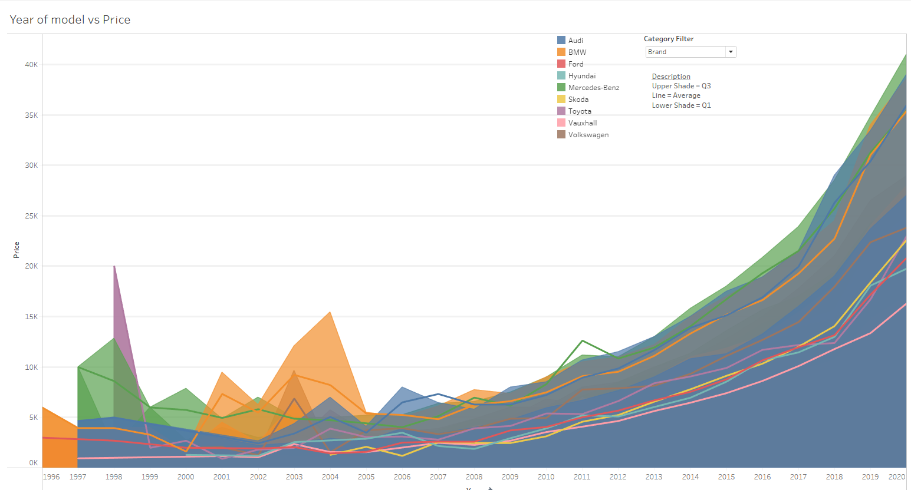

- As a tool, it allows the user to understand the average price (line) and distribution (25% Percentile and 75% Percentile shaded).
- Change the categories to see how each sold over time.
<br>

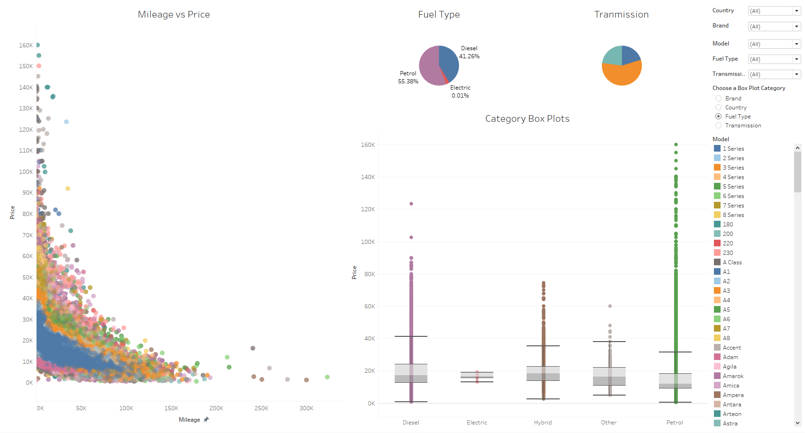

- This shows the distribution against price. There are many filter tools that allow you to understand how each category, including a single model of a car, differs in price.
<br>

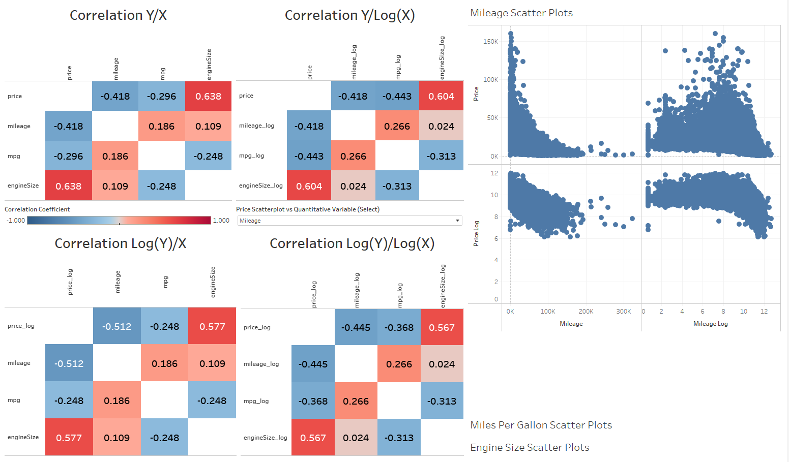

- This allows the user to select a sheet in the middle pane. It changes the category distributions against price and log(price).
- This correlation matrix allowed us to make a decision of whether we were going to transfor any of the quantitative variables by referencing the scatter plot, looking for linear relationships.
<br>


- Ultimately, it came down to either using Y or Log(Y), and we were able to see how many outliers there were in addition to analyzing the coefficients.
- We selected the price, with no transformation.
<br>

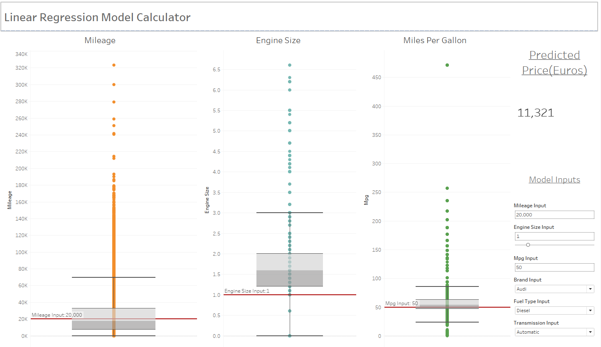

- The last dashboard in this tableu file is a calculator to provide an predicted estimate for a car based on the inputs by the user. This is to be used as a tool to predict car prices.
<br>

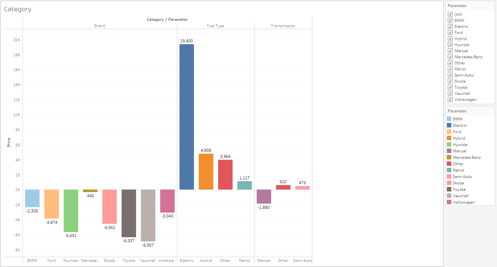

- This supplemented the discussion on how the model works by explaining the various values compared against "Audi", "Diesel", and "Automatic".

## <br>Challenges
- Lack of time.
- Coordinating different schedules and timezones.
- Maintaining appropriate file naming conventions and folder structure.
- Determining whether or not to further classify the data (in addition to 'country' and 'brand'), how we would classify it and an efficient way of extracting that information to apply it directly to our DataFrames.
  - We considered classifying the data by vehicle type (e.g. SUV, Coupe, Sedan, etc.), but ultimately could not as both North America and Europe (which is where the brand's in this dataset were manufactured) have different criteria (and even possibly different classifications) on how they may determine the vehicle type. Ideally, we would want a "master list" containing all the different classifications based on an international standard, with this we could then use a method of extracting the information (e.g. API call, web scraping, etc) and either creating a reference lookup table to correspond brands and models with or directly inserting it into our DataFrame based on conditional statements.
  - We considered classifying the data by weight classes (e.g. light duty, medium duty, heavy duty) but did not have that information listed in the dataset and this classification also most likely varies by country.
  - We considered classifying the data by engine size but since the data contained both North American and European brands they would also most likely be evaluated differently.
- Determining the suitable methods of outlier detection and/or removal, as well as interpreting the results. Since price relies heavily upon a multitude of factors, we struggled with deciding which variables could be removed.
- Regression analsysis required the application of a specific algorithm (outside of scope of current knowledge).

## <br>Future Considerations
- Creating a procedure for appropriate naming convention and folder structure.
- Develop our own list of classification to better categorize the data and use it to create more impactful visualizations.
- Automating the code when considering additional datasets added to the DataFrame. Currently, we have a dictionary defined to assign the country to the corresponding brand. Everytime a new brand is added to the dataset, we would then have to hardcode a country associated with it. For instance, we could use a Wikipedia API with HTML elements to extract data from a page containing a list of information about automobile manufacturers by country and create our own dictionary for all brands which we can be used and implemented into our DataFrame. As seen below, there was code that we were working on and from testing it seemed to work, but we did not have the time to run through the entirety of the Wikipedia page from A to Z.

Sample output from the result:

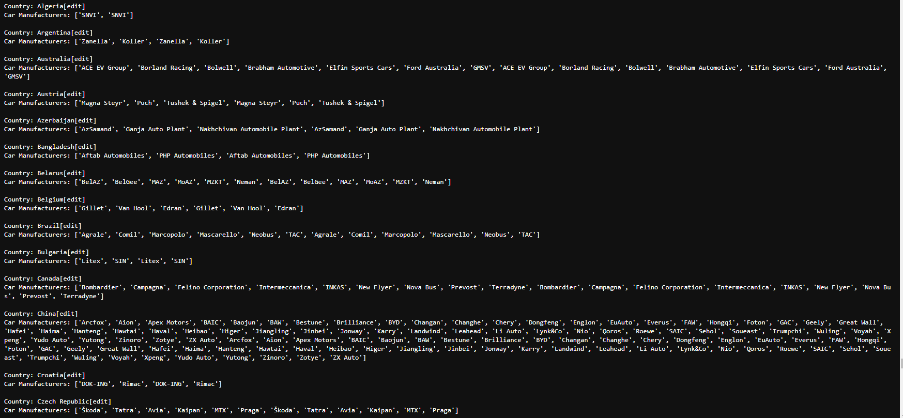

```python
# work-in-progresss
import requests
from bs4 import BeautifulSoup

def fetch_country_car_mapping_from_api():
    # ikipedia api endpoint for parsing content
    api_endpoint = "https://en.wikipedia.org/w/api.php"

    # dictionary to store country-car mapping
    country_car_mapping = {}

    # the webpage is split into sections A to Z which we can iterate through
    for section_number in range(1, 27):  # 26 sections for each letter of the alphabet
        # parameters for the api request to extract content for the specific section
        params = {
            'action': 'parse',
            'format': 'json',
            'page': 'List_of_current_automobile_manufacturers_by_country',
            'section': section_number
        }

        try:
            # send a request to the wikipedia api
            response = requests.get(api_endpoint, params = params)
            response_data = response.json()

            # check if the response is valid
            if 'parse' not in response_data:
                print(f"Failed to retrieve data for section {chr(64 + section_number)}")
                continue

            # extract the content from the parsed data
            content = response_data['parse']['text']['*']

            # use BeautifulSoup to parse the content
            soup = BeautifulSoup(content, 'html.parser')

            # process the data and extract country names and corresponding car manufacturers
            current_country = None
            for element in soup.find_all(['h3', 'ul']):
                if element.name == 'h3':
                    current_country = element.text.strip()
                    country_car_mapping.setdefault(current_country, [])
                elif element.name == 'ul' and current_country:
                    car_manufacturers = element.find_all('li')
                    for manufacturer in car_manufacturers:
                        country_car_mapping[current_country].append(manufacturer.text.strip())

            # introduce a delay to stay within api rate limits
            time.sleep(15)

        except requests.exceptions.RequestException as e:
            print(f"Error for section {chr(64 + section_number)}: {e}")

    return country_car_mapping

# fetch country-car mapping using the wikipedia api
country_car_mapping_api = fetch_country_car_mapping_from_api()

# print the obtained country-car mapping
for country, manufacturers in country_car_mapping_api.items():
    print(f"Country: {country}")
    print(f"Car Manufacturers: {manufacturers}\n")
```

- Implementation of the data into a SQL database.
- Determining a way to improve the overall performance on Tableau as it was slow when working with about 1000,000 rows.
